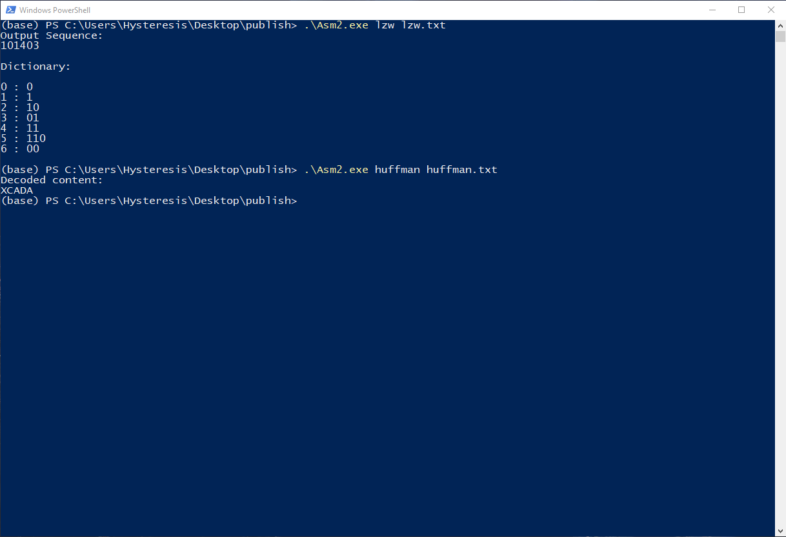

# How to compile:
## Supported Platform:
    Windows10 64-bit
## Prerequisite:
    Microsoft .Net Core SDK 2.1.x
    Microsoft .Net Core SDK 3.1.x
## Command: 
```powershell
dotnet publish -r win-x64 -c Release -p:PublishSingleFile=true --self-contained true
```

# How to run:
    1. Open a Windows Powershell window
    2. Navigate to root directory of Asm2.exe
    3. Running the following command:

        .\Asm.exe <huffman|lzw> <filename>
        
    



# Output:
    If running the program with 'huffman' option (first argument), output will be the decoded content for the given file (second argument).
    If running the program with 'lzw' option (first argument), output will be lzw encoded content and the dictionary of the given file (second argument).